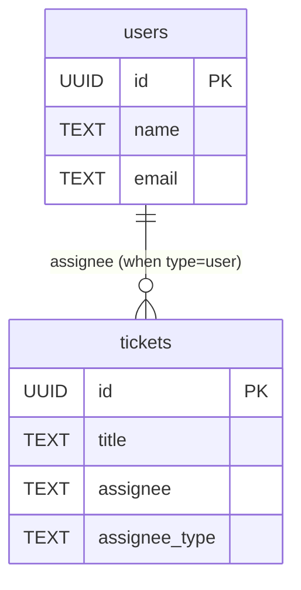
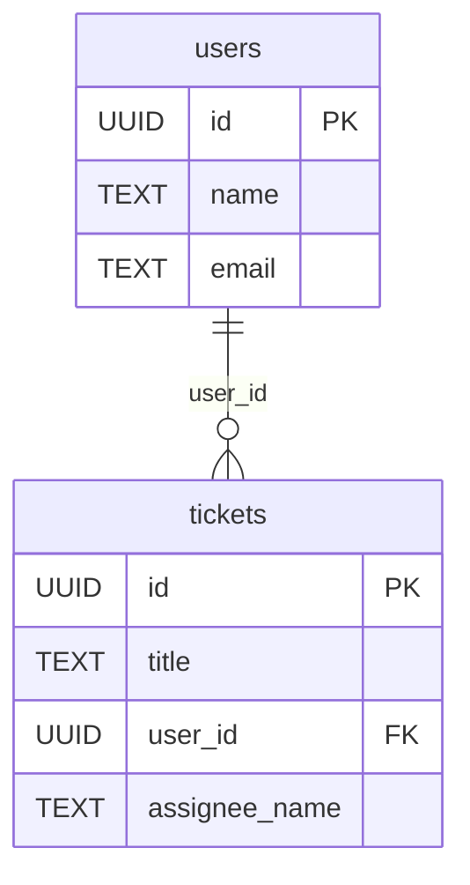

## はじめに
こんにちは、Lapi（[@dragoneena12](https://github.com/dragoneena12)）です。

最近は株式会社TOKIUMに縁あって入社することになり、Go言語を使ったアプリケーション開発に携わらせていただいてます。

そんなわけで僕のエンジニア人生で初めて大規模なDBを触ることとなったのですが、最初**パフォーマンスが悪すぎて全然クエリが終わらない**みたいな状況になってしまいました。それから頑張ってパフォーマンス改善をするという経験ができたので、この記事では実際のパフォーマンスチューニングの事例をもとに、PostgreSQLの実行計画の読み方とEAVアンチパターンについて紹介していきたいと思います。

## サンプルデータの用意

今回サンプルデータを用意してみたので、やってみたい方は手元で実行してみてください。

```console
docker run --rm --name sample-postgres -it -v $(pwd)/sample.sql:/docker-entrypoint-initdb.d/sample.sql -e POSTGRES_PASSWORD=password -d postgres
docker exec -it sample-postgres psql -U postgres
```

今回のサンプルデータは以下のようなテーブル構成になっています。



初期データとしてusersテーブルに10万件、ticketsテーブルに20万件が設定されています。
ticketsテーブルはassignee_typeが'user'の場合はusersテーブルを、'name'の場合は直接名前を格納します。

このように一つのカラムに複数の性質の値が入ることはSQLアンチパターンで書かれている EAV（Entity-Attribute-Value）というアンチパターンです。EAVを採用することにより、外部キー制約を掛けられなくなる、クエリが複雑化するなどさまざまな弊害が生じます。今回の例とは全く同じではありませんが、業務で開発しているコードに実際に似たようなテーブル構造が存在していました…。

こちらの記事ではこのアンチパターンがパフォーマンスにどのような影響があるのかを調査していきます。

## 実行計画の取得

まず、ticketsの情報をassigneeの名前と一緒に表示するクエリを実行してみましょう。
このクエリでは、assignee_typeに応じて適切なテーブルと結合し、COALESCEを使って名前を取得しています。
クエリの先頭にEXPLAIN句をつけることで、実行計画を取得することができます、

```sql
EXPLAIN SELECT 
    t.id,
    t.title,
    t.assignee_type,
    CASE 
        WHEN t.assignee_type = 'user' THEN u.name
        WHEN t.assignee_type = 'name' THEN t.assignee
    END AS assignee_name
FROM tickets t
LEFT JOIN users u ON t.assignee_type = 'user' AND t.assignee = u.id::TEXT
WHERE t.id = '00000000-0000-0001-0000-000000012345';
                                        QUERY PLAN                                         
-------------------------------------------------------------------------------------------
 Hash Right Join  (cost=8.45..2230.95 rows=1 width=65)
   Hash Cond: ((u.id)::text = t.assignee)
   Join Filter: (t.assignee_type = 'user'::text)
   ->  Seq Scan on users u  (cost=0.00..1935.00 rows=100000 width=25)
   ->  Hash  (cost=8.44..8.44 rows=1 width=61)
         ->  Index Scan using tickets_pkey on tickets t  (cost=0.42..8.44 rows=1 width=61)
               Index Cond: (id = '00000000-0000-0001-0000-000000012345'::uuid)
(7 rows)
```

いろいろな処理が書かれていますが、ここではusersテーブルに対して全件走査（Seq Scan）がかかっている部分に着目します。

```sql
   Hash Cond: ((u.id)::text = t.assignee)
   Join Filter: (t.assignee_type = 'user'::text)
   ->  Seq Scan on users u  (cost=0.00..1935.00 rows=100000 width=25)
```

usersテーブルはサイズが大きいため、全件走査はかなりのパフォーマンス低下につながってしまいます。usersテーブルのIDは主キーのため、本来はindexを使った高速な取得が可能なはずです。しかしticketsテーブルのassignee列はTEXT型となっており、usersテーブルのIDを比較するにはまずTEXT型へとキャストする必要があります。このためindexが使えなくなっているのが大きな原因です。

## テーブル構造の改善

現在のassigneeカラムはTEXT型になってしまっているため、userテーブルidカラムのインデックスを活用するにはテーブル構造をなにかしら修正してEAVを解消するしかありません。その方法としてはSTI（単一テーブル継承）、シリアライズLOBなどの方法があります。今回はSTIを採用したテーブル構造に修正してみましょう。以下のようなクエリを実行します。

```sql
-- user_idとassignee_nameカラムを追加
ALTER TABLE tickets ADD COLUMN user_id UUID;
ALTER TABLE tickets ADD COLUMN assignee_name TEXT;

-- 既存データを新しいカラムに移行
UPDATE tickets
SET user_id = assignee::UUID
WHERE assignee_type = 'user';

UPDATE tickets
SET assignee_name = assignee
WHERE assignee_type = 'name';

-- 外部キー制約を追加
ALTER TABLE tickets 
ADD CONSTRAINT fk_tickets_user 
FOREIGN KEY (user_id) REFERENCES users(id);

-- 不要になった古いカラムを削除
ALTER TABLE tickets DROP COLUMN assignee;
ALTER TABLE tickets DROP COLUMN assignee_type;
```

修正後のテーブル構造は以下のようになります。



STI構造のテーブルに修正したことにより、user_idカラムからはusersテーブルへの外部キー制約をかけることができました。ではこちらのテーブルに対しticketsの情報をassigneeの名前と一緒に表示するクエリを実行してみましょう。

```sql
EXPLAIN SELECT 
    t.id,
    t.title,
    COALESCE(u.name, t.assignee_name) AS assignee_name
FROM tickets t
LEFT JOIN users u ON t.user_id = u.id
WHERE t.id = '00000000-0000-0001-0000-000000012345';
                                     QUERY PLAN                                      
-------------------------------------------------------------------------------------
 Nested Loop Left Join  (cost=0.84..16.87 rows=1 width=60)
   ->  Index Scan using tickets_pkey on tickets t  (cost=0.42..8.44 rows=1 width=63)
         Index Cond: (id = '00000000-0000-0001-0000-000000012345'::uuid)
   ->  Index Scan using users_pkey on users u  (cost=0.42..8.44 rows=1 width=25)
         Index Cond: (id = t.user_id)
(5 rows)
```

今回は全件走査（Seq Scan）がなくなり、すべてインデックスを使った処理が走っていることがわかります。クエリコストも**2230.95から16.87へと大幅に削減**されました。

## まとめ

今回の記事ではEAVパターンとDBパフォーマンスの影響について実際に手元で実行計画を確認しながら調査してみました。EAVアンチパターンが実際のパフォーマンスにどう影響するかまで書かれた記事は少ないと思うので、DB設計をする上で参考にしていただけると嬉しいです。

## 参考文献

https://www.oreilly.co.jp/books/9784814400744/

https://www.postgresql.jp/document/17/html/index.html
