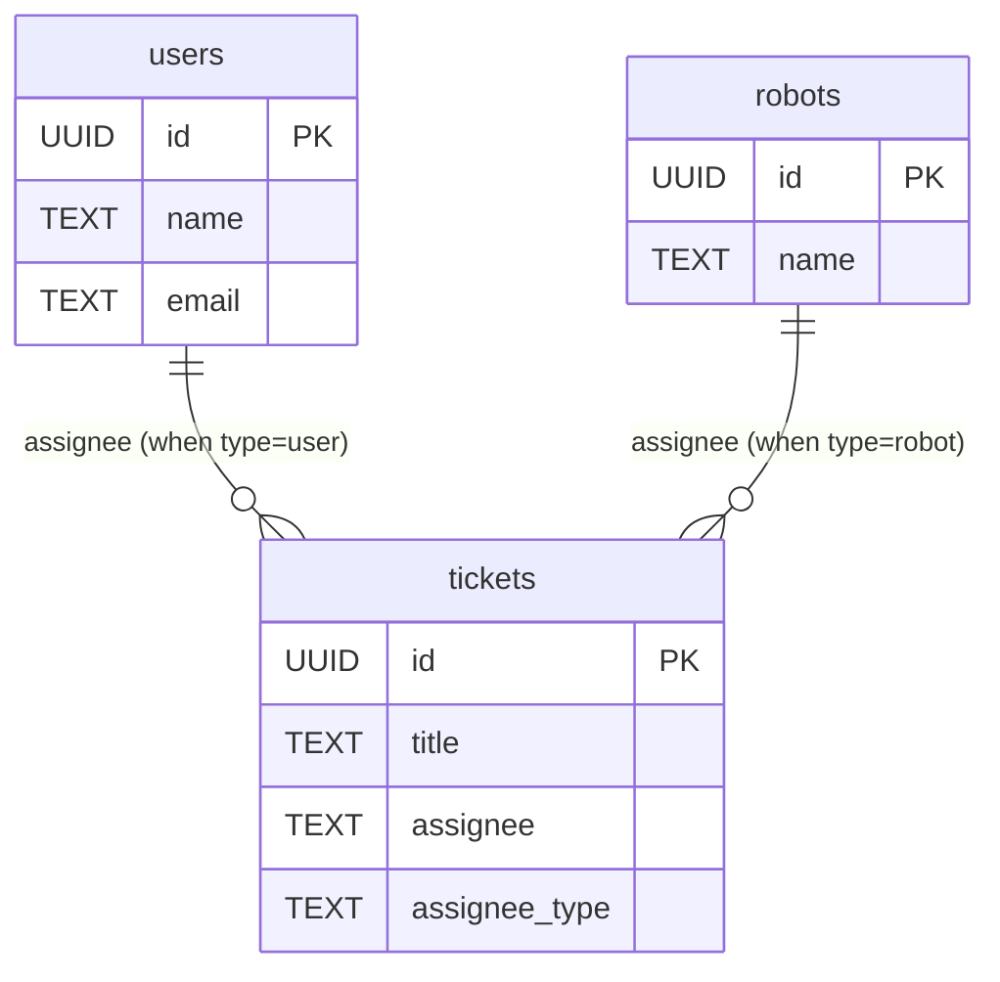

## はじめに
こんにちは、Lapi（[@dragoneena12](https://github.com/dragoneena12)）です。

最近は株式会社TOKIUMに縁あって入社することになり、Go言語を使ったアプリケーション開発に携わらせていただいてます。

そんなわけで僕のエンジニア人生で初めて大規模なDBを触ることとなったのですが、最初**パフォーマンスが悪すぎて全然クエリが終わらない**みたいな状況になってしまいました。それから頑張ってパフォーマンス改善をするという経験ができたので、この記事ではPostgreSQLの実行計画の読み方および実際のパフォーマンスチューニングの事例について紹介していきたいと思います。

## 実行計画の読み方

### サンプルデータの用意

今回サンプルデータを用意してみたので、やってみたい方は手元で実行してみてください。

```console
docker run --rm --name sample-postgres -it -v $(pwd)/sample1.sql:/docker-entrypoint-initdb.d/sample1.sql -e POSTGRES_PASSWORD=password -d postgres
docker exec -it sample-postgres psql -U postgres
```

今回のサンプルデータは以下のようなテーブル構成になっています。



ticketsテーブルはassignee_typeが'user'の場合はusersテーブルを、'robot'の場合はrobotsテーブルを、'name'の場合は直接名前を格納します。

これはいわゆるポリモーフィック関連というパターンで、SQLアンチパターン6章にも取り上げられているとおり基本的にはアンチパターンとされています。このパターンを採用したときにSQLやパフォーマンスがどのようになるかみていきましょう。

### パフォーマンスを測定してみる

まず、ticketsの情報をassigneeの名前と一緒に表示するクエリを実行してみましょう。
このクエリでは、assignee_typeに応じて適切なテーブルと結合し、COALESCEを使って名前を取得しています。
クエリの先頭にEXPLAIN句をつけることで、実行計画を取得することができます、

```sql
EXPLAIN SELECT 
    t.id,
    t.title,
    t.assignee_type,
    CASE 
        WHEN t.assignee_type = 'user' THEN u.name
        WHEN t.assignee_type = 'robot' THEN r.name
        WHEN t.assignee_type = 'name' THEN t.assignee
    END AS assignee_name
FROM tickets t
LEFT JOIN users u ON t.assignee_type = 'user' AND t.assignee = u.id::TEXT
LEFT JOIN robots r ON t.assignee_type = 'robot' AND t.assignee = r.id::TEXT
WHERE t.id = '00000000-0000-0002-0000-000000012345';
                                               QUERY PLAN                                               
--------------------------------------------------------------------------------------------------------
 Hash Right Join  (cost=1758.31..3841.63 rows=4 width=112)
   Hash Cond: ((u.id)::text = t.assignee)
   Join Filter: (t.assignee_type = 'user'::text)
   ->  Seq Scan on users u  (cost=0.00..1636.25 rows=70125 width=48)
   ->  Hash  (cost=1758.28..1758.28 rows=2 width=144)
         ->  Hash Right Join  (cost=8.32..1758.28 rows=2 width=144)
               Hash Cond: ((r.id)::text = t.assignee)
               Join Filter: (t.assignee_type = 'robot'::text)
               ->  Seq Scan on robots r  (cost=0.00..1523.52 rows=78752 width=48)
               ->  Hash  (cost=8.30..8.30 rows=1 width=112)
                     ->  Index Scan using tickets_pkey on tickets t  (cost=0.29..8.30 rows=1 width=112)
                           Index Cond: (id = '00000000-0000-0002-0000-000000012345'::uuid)
```

いろいろな処理が書かれていますが、ここでは以下の2つの部分に着目します。usersテーブルとrobotsテーブルに対し、全件走査（Seq Scan）がかかっていることがわかります。

```sql
   Hash Cond: ((u.id)::text = t.assignee)
   Join Filter: (t.assignee_type = 'user'::text)
   ->  Seq Scan on users u  (cost=0.00..1636.25 rows=70125 width=48)
...
               Hash Cond: ((r.id)::text = t.assignee)
               Join Filter: (t.assignee_type = 'robot'::text)
               ->  Seq Scan on robots r  (cost=0.00..1523.52 rows=78752 width=48)
```

この2つのテーブルはサイズが大きいため、全件走査はかなりのパフォーマンス低下につながってしまいます。usersテーブルやrobotsテーブルのIDは主キーのため、本来はindexを使った高速な取得が可能なはずです。しかしticketsテーブルのassignee列はTEXT型となっており、usersテーブルやrobotsテーブルのIDを比較するにはまずTEXT型へとキャストする必要があります。このためindexが使えなくなっているのが大きな原因です。


